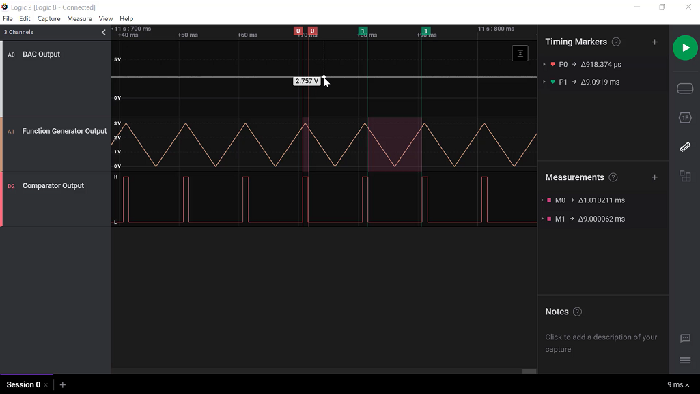
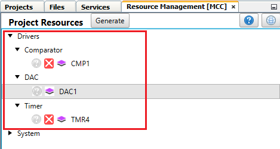
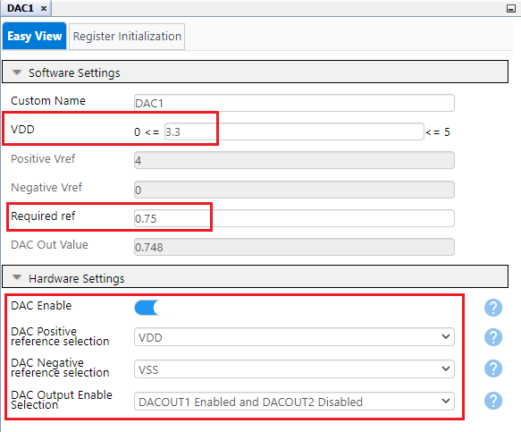
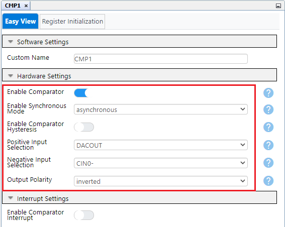
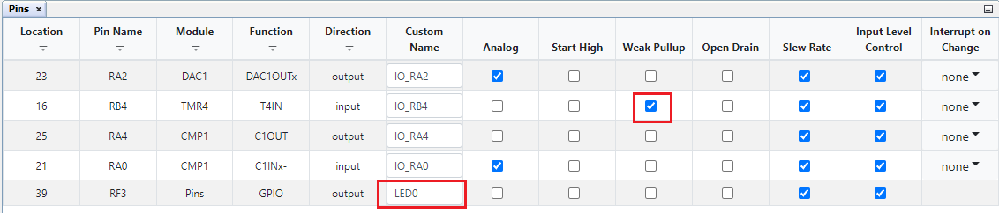

# Reference Voltage Generation using DAC of PIC18F57Q43 Microcontroller

## Related Documentation

- [PIC18F57Q43 Data Sheet](https://www.microchip.com/DS40002147)

## Objective

This application example highlights the usage of 8-bit DAC of PIC18F57Q43 as a reference voltage to CMP. This can be used in level sensing applications using voltage comparator. Two reference voltages, a lower reference voltage of 0.75 V and a higher reference voltage of 2.75 V are generated by changing DAC output dynamically upon switch press. On-board LED toggles on each switch press event.

  

 

In this application, DAC is configured to use VDD as the positive reference and ground as the negative reference. On each switch press event, DAC data register is updated to generate the respective reference voltage. TMR4  is used in monostable mode to automate the switch debouncing. 

A triangular wave of 3V peak to peak is generated using function generator which is connected to the negative channel of CMP. DAC output is connected to the positive channel of CMP. The CMP is configured in inverted polarity so that when triangular wave input is less than reference voltage, comparator gives a logic low output. When triangular wave input is greater than reference voltage, comparator gives a logic high output. Using the two reference voltages provided by DAC, two voltage levels can be detected using comparator. The reference voltage by DAC, function generator output and comparator output can be observed on oscilloscope/logic analyzer.

## Software Used

- MPLAB® X IDE [v6.00.0 or newer](https://www.microchip.com/mplab/mplab-x-ide)
- XC8 Compiler [v2.35.0 or newer](https://www.microchip.com/mplab/compilers)
- MPLAB® Code Configurator (MCC) [v5.1.0 or newer](https://www.microchip.com/mplab/mplab-code-configurator)
- Microchip PIC18F-Q series Device Support [v1.13.211 or newer](https://packs.download.microchip.com/)

## Hardware Used

- [PIC18F57Q43 Curiosity Nano Evaluation Kit](https://www.microchip.com/en-us/development-tool/DM164150)
- Logic analyzer/Oscilloscope
- Function Generator

## Hardware Setup

  

This demo is implemented using PIC18F57Q43 Curiosity Nano Evaluation Kit. Connect function generator output to pin RA0 of CNANO. Connect the same point to one of the analog channels of logic analyzer. Connect pin RA4 to a digital channel and pin RA2 to another analog channel of logic analyzer. The negative terminal of each channel, function generator GND and CNANO ground are connected for common GND. 

## Pin Connection Table

|Microcontroller Pin| Signal Description | 
|:------------------:|:-----------------:|
| RA0| CMP IN0- | 
| RA4 |CMP Output | 
| RA2 | DAC1 Buffered Output | 
| RB4 | SW0 | 
| RF3 | LED0 | 

## Demo Operation

Upon power-up the onboard LED of CNANO is turned ON. Observe the results in logic analyzer/oscilloscope. By default, the reference voltage generated by DAC is lower reference voltage of 0.75V. When function generator output is above 0.75 V, comparator output is logic high and when it is less than 0.75 V, comparator gives a logic low output.

  

Now press the on-board switch. The LED toggles and reference voltage generated by DAC changes to 2.75 V. Observe the results again in logic analyzer/oscilloscope. Now, when the function generator output is above 2.75 V, comparator output is logic high and when it is less than 2.75 V, comparator gives a logic low output.

  

## Peripheral Configuration

This section explains how to configure the peripherals using MPLAB X IDE with MCC plugin for recreation of the project. 

Refer [Software Used section](https://github.com/microchip-pic-avr-examples/pic18f57q43-dac-reference-voltage-generation-mplab-mcc/blob/master/README.md#software-used)to install required tools to recreate the project.

Additional Links: [MCC Melody Technical Reference](https://onlinedocs.microchip.com/v2/keyword-lookup?keyword=MCC.MELODY.INTRODUCTION&version=latest&redirect=true)

| Peripherals               | Configuration                                                                                                                                                                                                                                                                                                                                                                                                  | Usage                                                                         |
|---------------------------|----------------------------------------------------------------------------------------------------------------------------------------------------------------------------------------------------------------------------------------------------------------------------------------------------------------------------------------------------------------------------------------------------------------|-------------------------------------------------------------------------------|
|     Clock Control      |     Clock source - HFINTOSC HF Internal Clock - 4MHz Clock Divider   – 4                                                                                                                                                                                                                                                                                                         |     1 MHz System  clock                                                                     |
|     TMR4               |     Enable Timer Control Mode - Monostable  External Reset Source - T4CKIPPS pin Start/Reset Option - Starts on falling edge on TMR_ers Clock Source - MFINTOSC_31.25KHz Polarity - Rising edge Prescaler - 1:64 Postscaler - 1:1 Time Period - 0.1s TMR Interrupt Enabled                                                                                                                                                                    |     Used in monostable mode to  automate switch debouncing  |
|     DAC1               |     Enable DAC Vdd - 3.3 DAC Positive reference selection - VDD DAC Negative reference selection - VSS DAC Output Enable Selection - DACOUT1 Enabled and DACOUT2 Disabled          |     Used to generate reference voltages to CMP                                 |
|     CMP                |    Enable Comparator Enable Synchronous Mode - asynchronous Positive Input Selection - DACOUT Negative Input Selection - CIN0- Output Polarity - inverted    |     Used for lower and higher reference voltage detection          |

- **System Settings**

  

- **Add DAC, CMP and TMR4 peripherals**

  

- **DAC**
 

  

- **CMP**

  

- **TMR4**
 

  

  

 **Pin Grid View**
 
1.	Verify DAC output on pin RA2,CMP input (C1Inx-) on RA0 and CMP output on  RA4
2.	Configure T4IN on pin RB4 
3.	Configure pin RF3 as output for LED

  

  

- **Pins**

1.	Verify weak pull up is enabled on Pin RB4
2.	Rename pin RF3 to LED0

  

 

## Summary

A lower and higher reference voltages are generated using DAC peripheral of PIC18F57Q43 microcontroller which can be used for level sensing application using CMP.
